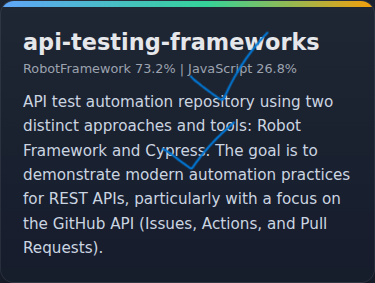
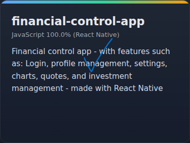
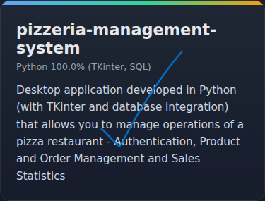
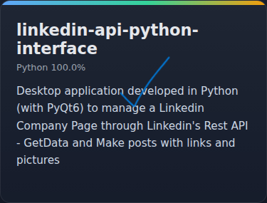

- 👋🏽 Hi, I’m Laura
- 📈 I’m interested in learning and improving as much as I can
- 🐍 I'm a huge Python fan, but I've also been learning a bit more about javascript frameworks, like React and ReactiveNative 😉
- 👩🏽‍💻 I work as a Middle QA, and I'm really enjoying communicating and working on new challenges!
- 👩🏽‍🎓 I'm in college for Software Engineering and recently graduated in Mechatronics Engineering

<!--  -->

Top Languages:  
- JavaScript - 35%  
- HTML - 15%  
- Python - 15%  
- CSS - 12%  
- RobotFramework - 8%  
- C - 4%  
- TypeScript - 4%  
- Java - 4%  
- PHP - 4%

 

Most interesting stuff:

<!-- 

 -->

